# Documentación Técnica - Sistema de Reportería

## 🔧 Arquitectura Técnica Detallada

### Patrón de Arquitectura
El sistema implementa una **arquitectura en capas** con separación clara de responsabilidades:

```
┌─────────────────────────────────────┐
│           FRONTEND (React)          │
│  ┌─────────────┐  ┌─────────────┐   │
│  │   Pages     │  │ Components  │   │
│  └─────────────┘  └─────────────┘   │
│  ┌─────────────┐  ┌─────────────┐   │
│  │  Services   │  │     API     │   │
│  └─────────────┘  └─────────────┘   │
└─────────────────────────────────────┘
                  │ HTTP/JSON
                  ▼
┌─────────────────────────────────────┐
│          BACKEND (Node.js)          │
│  ┌─────────────┐  ┌─────────────┐   │
│  │   Routes    │  │ Middleware  │   │
│  └─────────────┘  └─────────────┘   │
│  ┌─────────────┐  ┌─────────────┐   │
│  │ Controllers │  │   Config    │   │
│  └─────────────┘  └─────────────┘   │
└─────────────────────────────────────┘
                  │ SQL
                  ▼
┌─────────────────────────────────────┐
│        DATABASE (PostgreSQL)       │
└─────────────────────────────────────┘
```

## 🗄️ Modelo de Datos Detallado

### Esquema Completo de Base de Datos

```sql
-- Extensiones requeridas
CREATE EXTENSION IF NOT EXISTS "uuid-ossp";

-- Tabla principal de usuarios
CREATE TABLE usuarios (
    id UUID PRIMARY KEY DEFAULT uuid_generate_v4(),
    rol TEXT CHECK (rol IN ('administrador', 'donante', 'operador')),
    tipo_persona TEXT CHECK (tipo_persona IN ('Natural', 'Jurídica')),
    nombre TEXT NOT NULL,
    ruc TEXT UNIQUE,
    cedula TEXT UNIQUE,
    direccion TEXT,
    telefono TEXT,
    created_at TIMESTAMP WITH TIME ZONE DEFAULT NOW(),
    updated_at TIMESTAMP WITH TIME ZONE DEFAULT NOW()
);

-- Tabla de productos donados
CREATE TABLE productos_donados (
    id_producto SERIAL PRIMARY KEY,
    id_usuario UUID REFERENCES usuarios(id),
    nombre_producto TEXT NOT NULL,
    descripcion TEXT,
    cantidad NUMERIC(10,2) NOT NULL CHECK (cantidad > 0),
    unidad_medida TEXT NOT NULL,
    fecha_donacion TIMESTAMP WITH TIME ZONE DEFAULT NOW(),
    fecha_caducidad DATE,
    estado TEXT DEFAULT 'disponible' CHECK (estado IN ('disponible', 'agotado', 'vencido'))
);

-- Tabla de movimientos de productos
CREATE TABLE movimientos_productos (
    id_movimiento SERIAL PRIMARY KEY,
    tipo_movimiento TEXT NOT NULL CHECK (tipo_movimiento IN ('ingreso', 'egreso')),
    id_producto INTEGER REFERENCES productos_donados(id_producto),
    id_usuario UUID REFERENCES usuarios(id),
    id_solicitud INTEGER, -- Referencias opcional a sistema de solicitudes
    cantidad NUMERIC(10,2) NOT NULL CHECK (cantidad > 0),
    fecha_movimiento TIMESTAMP WITH TIME ZONE DEFAULT NOW(),
    observaciones TEXT,
    created_at TIMESTAMP WITH TIME ZONE DEFAULT NOW()
);

-- Vista materializada para inventario actual
CREATE MATERIALIZED VIEW inventario_actual AS
SELECT 
    pd.nombre_producto,
    pd.unidad_medida,
    SUM(pd.cantidad) as cantidad_total,
    SUM(pd.cantidad) - COALESCE(SUM(mp_egreso.cantidad), 0) as cantidad_disponible,
    COUNT(CASE WHEN pd.fecha_caducidad <= CURRENT_DATE + INTERVAL '30 days' THEN 1 END) as productos_por_vencer,
    MAX(COALESCE(mp.fecha_movimiento, pd.fecha_donacion)) as fecha_ultima_actualizacion
FROM productos_donados pd
LEFT JOIN movimientos_productos mp_egreso ON pd.id_producto = mp_egreso.id_producto 
    AND mp_egreso.tipo_movimiento = 'egreso'
LEFT JOIN movimientos_productos mp ON pd.id_producto = mp.id_producto
WHERE pd.estado = 'disponible'
GROUP BY pd.nombre_producto, pd.unidad_medida
HAVING SUM(pd.cantidad) - COALESCE(SUM(mp_egreso.cantidad), 0) > 0;

-- Tabla de historial de reportes
CREATE TABLE reportes_generados (
    id_reporte SERIAL PRIMARY KEY,
    tipo_reporte TEXT NOT NULL CHECK (tipo_reporte IN ('inventario', 'movimientos', 'donaciones')),
    id_usuario UUID NOT NULL REFERENCES usuarios(id),
    fecha_generacion TIMESTAMP WITH TIME ZONE DEFAULT NOW(),
    parametros_filtro JSONB DEFAULT '{}',
    total_registros INTEGER NOT NULL,
    archivo_exportado TEXT,
    formato_exportacion TEXT CHECK (formato_exportacion IN ('excel', 'csv')),
    created_at TIMESTAMP WITH TIME ZONE DEFAULT NOW()
);

-- Índices para optimización
CREATE INDEX idx_productos_donados_usuario ON productos_donados(id_usuario);
CREATE INDEX idx_productos_donados_fecha ON productos_donados(fecha_donacion);
CREATE INDEX idx_movimientos_fecha ON movimientos_productos(fecha_movimiento);
CREATE INDEX idx_movimientos_tipo ON movimientos_productos(tipo_movimiento);
CREATE INDEX idx_reportes_tipo ON reportes_generados(tipo_reporte);
CREATE INDEX idx_reportes_fecha ON reportes_generados(fecha_generacion);

-- Triggers para actualizar timestamp
CREATE OR REPLACE FUNCTION update_updated_at_column()
RETURNS TRIGGER AS $$
BEGIN
    NEW.updated_at = NOW();
    RETURN NEW;
END;
$$ language 'plpgsql';

CREATE TRIGGER update_usuarios_updated_at BEFORE UPDATE ON usuarios
    FOR EACH ROW EXECUTE FUNCTION update_updated_at_column();
```

## 🔄 Flujo de Datos y Procesamiento

### 1. Flujo de Generación de Reportes

```mermaid
graph TD
    A[Usuario solicita reporte] --> B{¿Incluye exportación?}
    B -->|No| C[Consulta SQL directa]
    B -->|Sí| D[Consulta SQL + Exportación]
    C --> E[Retorna JSON]
    D --> F[Genera archivo Excel/CSV]
    F --> G[Registra en historial]
    G --> H[Retorna archivo para descarga]
    E --> I[Frontend muestra tabla]
    H --> J[Usuario descarga archivo]
```



### 2. Procesamiento de Consultas

**Inventario:**
```sql
-- Optimizada con agregaciones y JOINs eficientes
SELECT 
    ia.nombre_producto,
    ia.unidad_medida,
    ia.cantidad_total,
    ia.cantidad_disponible,
    ia.productos_por_vencer,
    ia.fecha_ultima_actualizacion,
    CASE 
        WHEN ia.cantidad_total > 0 THEN 
            ROUND((ia.cantidad_total - ia.cantidad_disponible) * 100.0 / ia.cantidad_total, 2)
        ELSE 0 
    END as porcentaje_utilizado
FROM inventario_actual ia
WHERE ia.cantidad_total > 0
ORDER BY ia.cantidad_disponible DESC, ia.nombre_producto;
```

**Movimientos con filtros:**
```sql
-- Consulta parameterizada con filtros opcionales
SELECT 
    mp.fecha_movimiento,
    mp.tipo_movimiento,
    COALESCE(pd.nombre_producto, 'Producto ' || mp.id_producto) as nombre_producto,
    COALESCE(pd.unidad_medida, 'Unidad') as unidad_medida,
    mp.cantidad,
    COALESCE(u.nombre, 'Usuario ' || mp.id_usuario) as usuario_responsable,
    COALESCE(u.rol, 'Sin rol') as rol_usuario,
    COALESCE(mp.observaciones, 'Sin observaciones') as observaciones,
    CASE 
        WHEN mp.id_solicitud IS NOT NULL THEN 'Entrega por solicitud'
        WHEN mp.tipo_movimiento = 'ingreso' THEN 'Donación'
        ELSE 'Movimiento manual'
    END as origen_movimiento
FROM movimientos_productos mp
LEFT JOIN productos_donados pd ON mp.id_producto = pd.id_producto
LEFT JOIN usuarios u ON mp.id_usuario = u.id
WHERE mp.fecha_movimiento >= COALESCE($1::date, CURRENT_DATE - INTERVAL '30 days')
  AND mp.fecha_movimiento <= COALESCE($2::date, CURRENT_DATE + INTERVAL '1 day')
  AND ($3::text IS NULL OR mp.tipo_movimiento = $3::text)
  AND ($4::text IS NULL OR COALESCE(pd.nombre_producto, 'Producto ' || mp.id_producto) ILIKE '%' || $4 || '%')
ORDER BY mp.fecha_movimiento DESC, mp.id_movimiento DESC;
```

## 🎯 API Design Patterns

### 1. Estructura de Respuestas

**Respuesta exitosa:**
```json
{
  "success": true,
  "data": [...],
  "total": 150,
  "filters": {
    "fecha_inicio": "2025-01-01",
    "fecha_fin": "2025-07-16"
  },
  "generatedAt": "2025-07-16T20:00:00.000Z"
}
```

**Respuesta de error:**
```json
{
  "success": false,
  "message": "Error descriptivo para el usuario",
  "error": "Detalles técnicos del error",
  "code": "VALIDATION_ERROR"
}
```

### 2. Middleware Chain

```javascript
// Orden de ejecución de middlewares
app.use('/api/reports', [
  cors(),                    // CORS headers
  authenticateToken,         // JWT validation
  rateLimiter,              // Rate limiting (futuro)
  validateRequest,          // Input validation (futuro)
  reportsRouter             // Route handlers
]);
```

### 3. Controller Pattern

```javascript
class ReportsController {
  // Patrón: Validación -> Consulta -> Procesamiento -> Respuesta
  async getInventoryReport(req, res) {
    try {
      // 1. Validación de parámetros
      const { export_format } = req.query;
      const userId = req.user?.id;

      // 2. Consulta a base de datos
      const result = await query(inventoryQuery);
      const reportData = result.rows;

      // 3. Procesamiento condicional
      if (export_format && ['excel', 'csv'].includes(export_format)) {
        // Exportación
        const filePath = await this.exportReport(reportData, 'inventario', export_format);
        await this.registerReport('inventario', userId, {}, reportData.length, export_format);
        return res.download(filePath);
      }

      // 4. Respuesta JSON estándar
      res.json({
        success: true,
        data: reportData,
        total: reportData.length,
        generatedAt: new Date().toISOString()
      });

    } catch (error) {
      // 5. Manejo de errores centralizado
      console.error('Error en reporte de inventario:', error);
      res.status(500).json({
        success: false,
        message: 'Error al generar reporte de inventario',
        error: error.message
      });
    }
  }
}
```

## 📊 Sistema de Exportación

### 1. Generación de Excel con ExcelJS

```javascript
// Configuración profesional de Excel
const workbook = new ExcelJS.Workbook();

// Metadatos del workbook
workbook.creator = 'Sistema de Reportería - Banco de Alimentos';
workbook.lastModifiedBy = 'Sistema de Reportería';
workbook.created = new Date();
workbook.modified = new Date();

// Configuración de worksheet
const worksheet = workbook.addWorksheet(sheetName);

// Definición de columnas con anchos optimizados
worksheet.columns = columns.map(col => ({
  header: col.header,
  key: col.key,
  width: Math.max(col.header.length + 5, 15)
}));

// Estilos profesionales
worksheet.getRow(1).eachCell((cell) => {
  cell.font = { bold: true, color: { argb: 'FFFFFFFF' } };
  cell.fill = {
    type: 'pattern',
    pattern: 'solid',
    fgColor: { argb: 'FF4472C4' }
  };
  cell.border = {
    top: { style: 'thin' },
    left: { style: 'thin' },
    bottom: { style: 'thin' },
    right: { style: 'thin' }
  };
  cell.alignment = { vertical: 'middle', horizontal: 'center' };
});
```

### 2. Gestión de Archivos

```javascript
// Estructura de nombres de archivo
const timestamp = new Date().toISOString().replace(/[:.]/g, '-');
const fileExtension = format === 'excel' ? 'xlsx' : format;
const fileName = `${reportType}_${timestamp}.${fileExtension}`;

// Headers de descarga optimizados
if (export_format === 'excel') {
  res.setHeader('Content-Type', 'application/vnd.openxmlformats-officedocument.spreadsheetml.sheet');
  res.setHeader('Content-Disposition', `attachment; filename="${fileName}"`);
}
```

## 🔐 Sistema de Seguridad

### 1. Autenticación JWT (Producción)

```javascript
// Generación de token
const token = jwt.sign(
  { 
    id: user.id, 
    rol: user.rol,
    exp: Math.floor(Date.now() / 1000) + (24 * 60 * 60) // 24h
  },
  process.env.JWT_SECRET
);

// Verificación de token
jwt.verify(token, process.env.JWT_SECRET, (err, decoded) => {
  if (err) return res.status(403).json({ success: false, message: 'Token inválido' });
  req.user = decoded;
  next();
});
```

### 2. Validación de Entrada

```javascript
// Sanitización de parámetros de query
const sanitizeQueryParams = (params) => {
  const { fecha_inicio, fecha_fin, tipo_movimiento, producto } = params;
  
  return {
    fecha_inicio: fecha_inicio ? new Date(fecha_inicio).toISOString().split('T')[0] : null,
    fecha_fin: fecha_fin ? new Date(fecha_fin).toISOString().split('T')[0] : null,
    tipo_movimiento: tipo_movimiento && ['ingreso', 'egreso'].includes(tipo_movimiento) ? tipo_movimiento : null,
    producto: producto ? producto.toString().substring(0, 100) : null // Limitar longitud
  };
};
```

### 3. Prevención de SQL Injection

```javascript
// Uso de consultas parametrizadas
const result = await query(movementsQuery, [
  fecha_inicio || null, 
  fecha_fin || null, 
  tipo_movimiento || null, 
  producto || null
]);

// Nunca concatenar strings en SQL
// ❌ MALO: `SELECT * FROM tabla WHERE nombre = '${nombre}'`
// ✅ BUENO: query('SELECT * FROM tabla WHERE nombre = $1', [nombre])
```

## 🚀 Optimización de Performance

### 1. Consultas Optimizadas

```sql
-- Uso de índices estratégicos
CREATE INDEX CONCURRENTLY idx_movimientos_fecha_tipo 
ON movimientos_productos(fecha_movimiento, tipo_movimiento);

-- Consultas con LIMIT para paginación
SELECT * FROM reportes_generados 
ORDER BY fecha_generacion DESC 
LIMIT $1 OFFSET $2;

-- Agregaciones eficientes
SELECT 
  COUNT(*) as total_movimientos,
  SUM(CASE WHEN tipo_movimiento = 'ingreso' THEN cantidad ELSE 0 END) as total_ingresos,
  SUM(CASE WHEN tipo_movimiento = 'egreso' THEN cantidad ELSE 0 END) as total_egresos
FROM movimientos_productos 
WHERE fecha_movimiento >= $1;
```

### 2. Caching Strategy (Futuro)

```javascript
// Cache de consultas frecuentes con Redis
const getCachedInventory = async () => {
  const cacheKey = 'inventory:current';
  const cached = await redis.get(cacheKey);
  
  if (cached) {
    return JSON.parse(cached);
  }
  
  const fresh = await query(inventoryQuery);
  await redis.setex(cacheKey, 300, JSON.stringify(fresh.rows)); // 5 minutos
  return fresh.rows;
};
```

### 3. Connection Pooling

```javascript
// Configuración del pool de conexiones
const pool = new Pool({
  host: process.env.DB_HOST,
  port: process.env.DB_PORT,
  database: process.env.DB_NAME,
  user: process.env.DB_USER,
  password: process.env.DB_PASSWORD,
  max: 20,                    // Máximo 20 conexiones
  idleTimeoutMillis: 30000,   // Timeout de conexiones idle
  connectionTimeoutMillis: 2000, // Timeout de conexión
});
```

## 🔧 Configuración de Entornos

### 1. Variables de Entorno por Ambiente

**Desarrollo (.env.development):**
```env
NODE_ENV=development
DB_HOST=localhost
DB_PORT=5432
DB_NAME=banco_de_alimentos_dev
LOG_LEVEL=debug
ENABLE_CORS=true
```

**Staging (.env.staging):**
```env
NODE_ENV=staging
DB_HOST=staging-db.ejemplo.com
DB_PORT=5432
DB_NAME=banco_de_alimentos_staging
LOG_LEVEL=info
ENABLE_CORS=false
```

**Producción (.env.production):**
```env
NODE_ENV=production
DB_HOST=prod-db.ejemplo.com
DB_PORT=5432
DB_NAME=banco_de_alimentos_prod
LOG_LEVEL=error
ENABLE_CORS=false
JWT_SECRET=super_secret_production_key
```

### 2. Configuración de Logging

```javascript
const winston = require('winston');

const logger = winston.createLogger({
  level: process.env.LOG_LEVEL || 'info',
  format: winston.format.combine(
    winston.format.timestamp(),
    winston.format.errors({ stack: true }),
    winston.format.json()
  ),
  transports: [
    new winston.transports.File({ filename: 'logs/error.log', level: 'error' }),
    new winston.transports.File({ filename: 'logs/combined.log' }),
    new winston.transports.Console({
      format: winston.format.simple()
    })
  ]
});
```

## 🧪 Testing Strategy

### 1. Unit Tests (Jest)

```javascript
// Ejemplo de test para controller
describe('ReportsController', () => {
  describe('getInventoryReport', () => {
    it('should return inventory data in JSON format', async () => {
      const mockReq = { query: {}, user: { id: 'test-uuid' } };
      const mockRes = { json: jest.fn() };
      
      await controller.getInventoryReport(mockReq, mockRes);
      
      expect(mockRes.json).toHaveBeenCalledWith({
        success: true,
        data: expect.any(Array),
        total: expect.any(Number),
        generatedAt: expect.any(String)
      });
    });
  });
});
```

### 2. Integration Tests

```javascript
// Test de endpoints con supertest
const request = require('supertest');
const app = require('../server');

describe('Reports API', () => {
  it('GET /api/reports/inventory should return 200', async () => {
    const response = await request(app)
      .get('/api/reports/inventory')
      .set('Authorization', 'Bearer ' + validToken)
      .expect(200);
      
    expect(response.body.success).toBe(true);
    expect(response.body.data).toBeInstanceOf(Array);
  });
});
```

## 📊 Monitoreo y Métricas

### 1. Health Checks

```javascript
// Endpoint de salud del sistema
app.get('/health', async (req, res) => {
  try {
    // Test de conexión a base de datos
    await query('SELECT 1');
    
    res.status(200).json({
      status: 'healthy',
      timestamp: new Date().toISOString(),
      uptime: process.uptime(),
      memory: process.memoryUsage(),
      database: 'connected'
    });
  } catch (error) {
    res.status(503).json({
      status: 'unhealthy',
      error: error.message
    });
  }
});
```

### 2. Métricas de Aplicación

```javascript
// Middleware para tracking de requests
const requestCounter = {
  total: 0,
  byEndpoint: {},
  errors: 0
};

app.use((req, res, next) => {
  requestCounter.total++;
  requestCounter.byEndpoint[req.path] = (requestCounter.byEndpoint[req.path] || 0) + 1;
  
  res.on('finish', () => {
    if (res.statusCode >= 400) {
      requestCounter.errors++;
    }
  });
  
  next();
});
```

## 🔄 Deployment y CI/CD

### 1. Docker Configuration

```dockerfile
# Dockerfile para producción
FROM node:18-alpine

WORKDIR /app

# Instalar dependencias
COPY package*.json ./
RUN npm ci --only=production

# Copiar código fuente
COPY . .

# Usuario no root
RUN addgroup -g 1001 -S nodejs
RUN adduser -S nextjs -u 1001
USER nextjs

EXPOSE 3001

CMD ["npm", "start"]
```

### 2. Docker Compose

```yaml
# docker-compose.yml
version: '3.8'
services:
  app:
    build: .
    ports:
      - "3001:3001"
    environment:
      - NODE_ENV=production
      - DB_HOST=db
    depends_on:
      - db
    volumes:
      - ./exports:/app/exports
      
  db:
    image: postgres:14
    environment:
      POSTGRES_DB: banco_de_alimentos
      POSTGRES_USER: reporteria_user
      POSTGRES_PASSWORD: ${DB_PASSWORD}
    volumes:
      - postgres_data:/var/lib/postgresql/data
      - ./database/schema.sql:/docker-entrypoint-initdb.d/schema.sql

volumes:
  postgres_data:
```

## 🛠️ Troubleshooting Avanzado

### 1. Debugging de Consultas SQL

```javascript
// Logger de consultas SQL
const originalQuery = pool.query;
pool.query = function(...args) {
  const startTime = Date.now();
  console.log('SQL Query:', args[0]);
  console.log('Parameters:', args[1]);
  
  return originalQuery.apply(this, args).then(result => {
    const duration = Date.now() - startTime;
    console.log(`Query completed in ${duration}ms, returned ${result.rows.length} rows`);
    return result;
  });
};
```

### 2. Memory Profiling

```javascript
// Monitoreo de memoria
setInterval(() => {
  const usage = process.memoryUsage();
  console.log({
    rss: Math.round(usage.rss / 1024 / 1024) + ' MB',
    heapTotal: Math.round(usage.heapTotal / 1024 / 1024) + ' MB',
    heapUsed: Math.round(usage.heapUsed / 1024 / 1024) + ' MB',
    external: Math.round(usage.external / 1024 / 1024) + ' MB'
  });
}, 30000); // Cada 30 segundos
```

---

**Documentación Técnica v1.0**  
**Última actualización:** Julio 16, 2025  
**Mantenida por:** Equipo de Desarrollo
